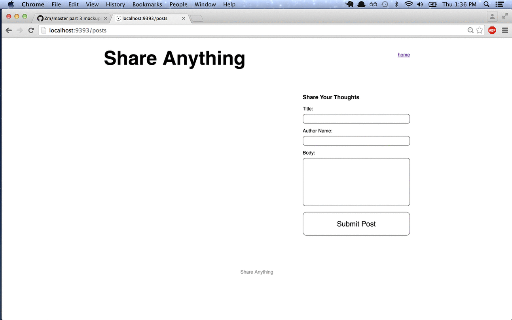
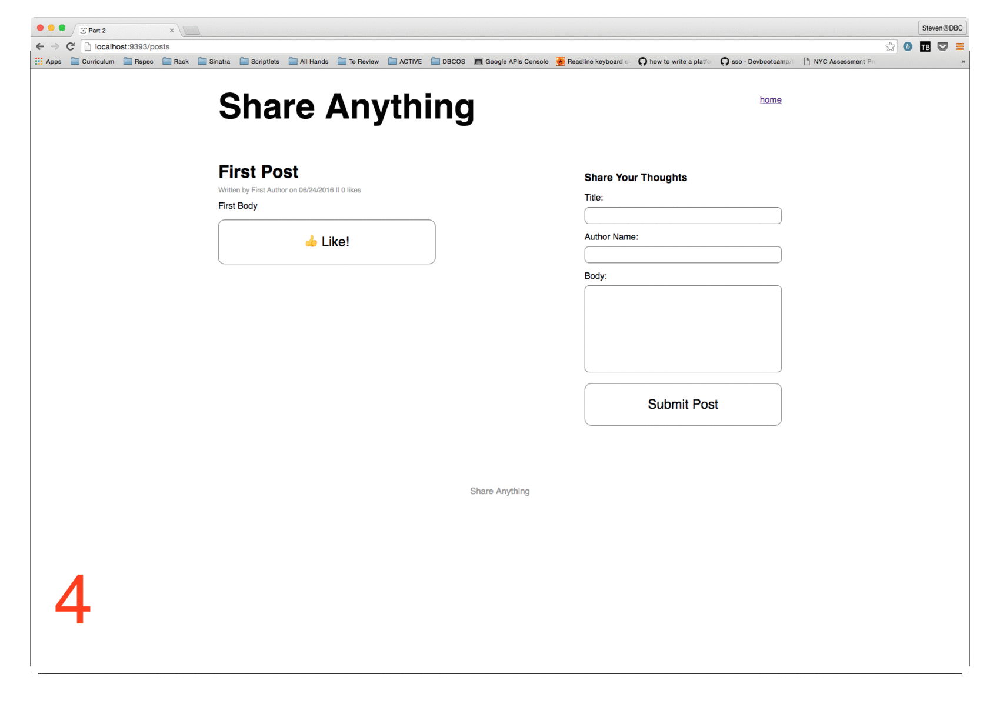
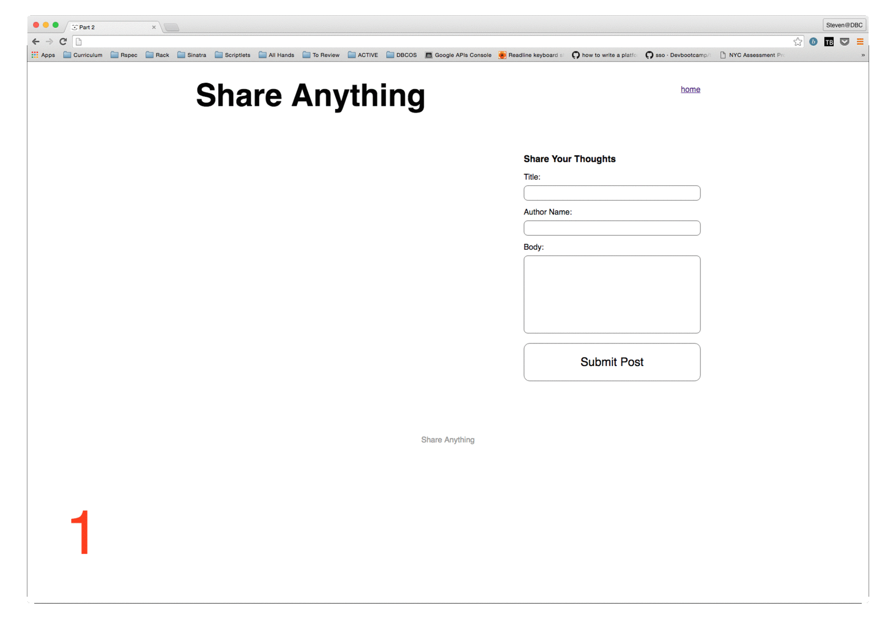

# Part 2:  AJAX

## Summary

In Part 2 we'll take a functioning Sinatra application and enhance the user
experience by adding some AJAX calls.

### User Stories

#### Current Site

The application is a site where users can write posts.  The animated gif here
should provide some demonstration of how this works:



1. **Frame 1**: User visits the site root. All `Post`s are listed in the main
   body of the page. On first visit this will be empty.
1. **Frame 2**: User fills out the form
1. **Frame 3**: User submits the form
1. **Frame 4**: User is redirected to a page that shows the newly-created `Post`.
1. **Frame 5**: User can click on a "Like" button
1. **Frame 6**: Clicking the "Like" button sends data to the server and
   re-renders the page with an incremented "Like" count.

#### Future Site

Our enhancements will make it so the user never leaves the homepage.  All the
requests will be AJAX requests and the DOM will update based on the responses.
After the site is updated, here's what the user experience will be:

1. **Frame 1**: User visits the site root. All `Post`s are listed in the main
1. **Frame 2**: User fills out the form
1. **Frame 3**: User submits the form
1. **Frame 4**: Details of the saved `Post` are added to the DOM (without refreshing). The form is also reset thus allowing another `Post`.

The animated gif here should provide some demonstration of how this works:



##### Liking

In addition to AJAXifying the site, you should add the ability for users to "like" a post. This flow will, again, keep the user on the same page.

1. **Frame 1**: User visits the site root.
1. **Frame 2**: User clicks on a like button.
1. **Frame 3**: The "Like" count is incremented by `1` for that `Post` in the DOM.

The animated gif here should provide some demonstration of how this works:




### Testing
Feature tests are provided in Part 2 of the assessment to guide our enhancement efforts. These types of tests might be unfamiliar.  We don't need to understand how to set up or write such tests.  We'll just use them as a guide.

## Releases
### Pre-release:  Setup
We'll need to make sure that everything is set up before we begin working on the application.  From the command line, navigate to the `part-2` directory of the phase 2 assessment.  Once there, run ...

0. `$ brew update; brew install phantomjs`
0. Ensure the installation worked. If not ask for help. Executing `phantomjs -v` should return a version number greater than `2.1` (e.g. `2.1.0`, `2.1.1`, `2.2`, `2.3`, etc.)
0. `$ bundle`
0. `$ bundle exec rake db:create`
0. `$ bundle exec rake db:migrate`
0. `$ bundle exec rake db:migrate RACK_ENV=test`

### Release 0: AJAX
Now we'll take our application and enhance its functionality.  But, we don't want to break our functioning site in the process.  Fortunately, there are tests to help us.  Tests have been written to describe the `Post` class (see `spec/models/post_spec.rb`) and the feature of writing a new post (see `spec/features/writing_a_post_spec.rb`).

The feature tests for writing a new post include two contexts:  without javascript and with javascript.  The code you are provided with will pass the scenarios where javascript is not being used.  The with-javascript scenarios fail with just the provided code.

Our task is to make the with-javascript scenarios pass.  When our site is functioning properly with AJAX, all scenarios should pass.  Don't break the without-javascript test to pass the with-javascript test.

To run the tests and see the with-javascript feature test fail, from the command line, run ...

```
$ bundle exec rspec
```

Use the failing scenario and future-site user story from the *Summary* to guide your development until all the tests pass.

## Conclusion
Once all the tests have passed, you have completed Part 2 of the assessment. If you haven't done so already, commit your changes and move on to Part 3.
