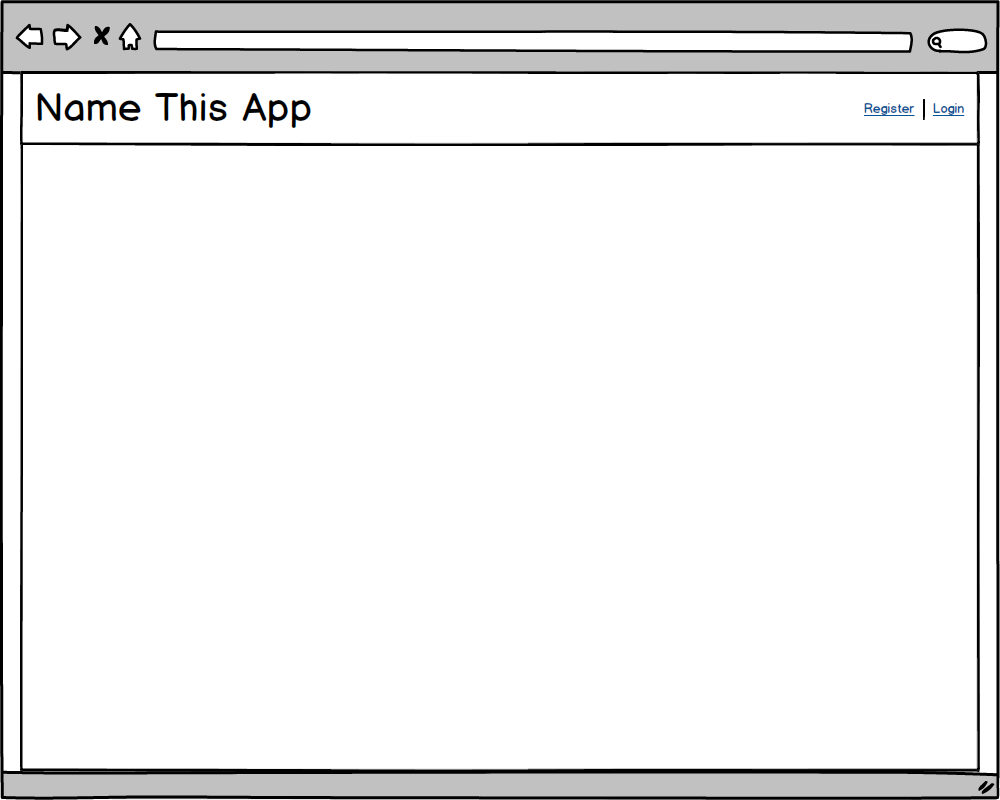
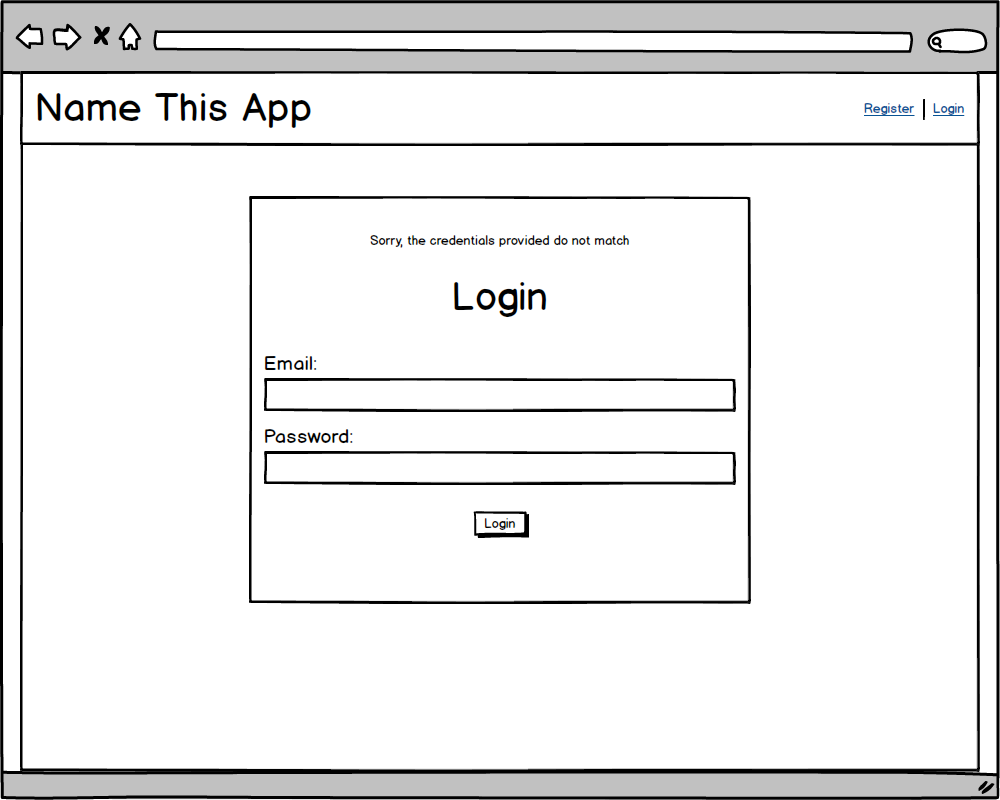
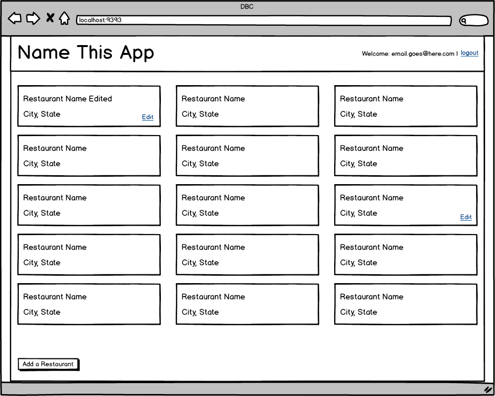
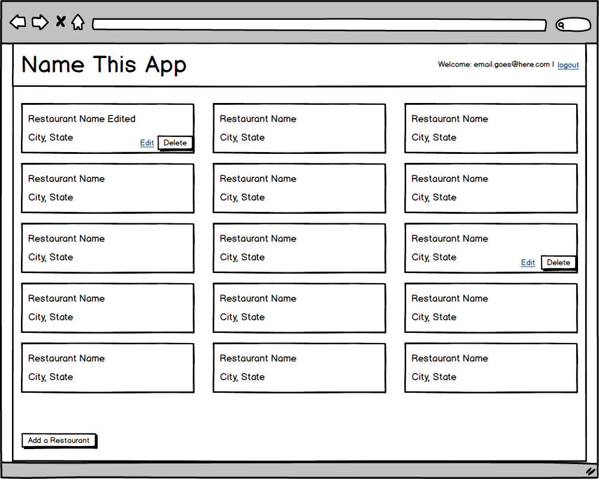

# Part 3: Build a CRUD App

## Summary

In Part 3 of the assessment, we will demonstrate our proficiency in building
web-stack applications: user authentication, associations, validations,
controllers, views, etc. Even a little bit of CSS.

### Site Overview
In this section, we will build a simplified version of Yelp. We will not worry about locations or ways of categorizing listings, but instead focus solely on creating restaurants and allowing users to review them.

The required functionality of the site will be described in more detail in the
*Releases* section, but here's a basic overview.

#### All Users
- Browse available restaurants

#### Unregistered Users**
- Register a new account

#### Registered Users
- Sign in
- Sign out
- Create new restaurants
- Review a restaurant

### Completing the App
Complete as much of this CRUD app as possible in the time allowed.  If time is
running out and it looks like the app will not be completed, continue to work
through the releases in order and complete as much as possible. Be sure to ask
questions, if you find yourself stuck.

## Releases
### Pre-release:  Setup
We'll need to make sure that everything is set up before we begin working on the application.  From the command line, navigate to the `part-3` directory of the phase 2 assessment.  Once there, run ...

0. `$ bundle`
0. `$ bundle exec rake db:create`

### Release 0: User Registration
_Given:_

* The current user does not have an account.

---------

1. Create a "Register" link on the homepage.
1. Present the user with a form to create a new account (username/email, password)
  * Username/emails must be unique
1. Upon submission, the user should be taken back to the homepage.
1. The "Registration" link should no longer be visible.
1. The user should see "Welcome: [username/email]"

If the username/email has already been taken, the user should see the registration form and an error message "Sorry, but that [username/email] has already been taken".

### Release 1: Login/Logout
#### Login
_Given:_

* There is a previously registered user
* User is not currently logged in:
-------

1. On the home page, create a link to login next to the registration link.
1. When a user clicks on this link they should be taken to a page with a form to
   enter their credentials.
1. If the credentials match, the user should be taken back to the homepage and the
   login link should be replaced with a logout link.

If the credentials do not match, the user should see the login form and an error message stating the credentials were not valid.

#### Logout
_Given:_

* There is a previously registered user
* User is currently logged in
--------

1. On the home page, create a link to logout.
1. When the user clicks on the logout link they should be taken to the home page
   and the links "Register" and "Login" should both be visible.

### Release 2: CRUD'ing a Resorouce
We'll not give users the ability to add new restaurants to the site.

#### Creating Restuarants
_Given:_

* The registered user is signed in:

--------

1. On the home page create a link to add a restaurant
  * This link should only be visible to signed in users
1. When the user clicks on the add restaurant link they should be taken to a page where they can enter the following information:
  * name
  * cuisine (e.g., American Pub, French Bakery, etc.)
  * address
  * city
  * state
  * zip
1. When the user submits the form
  * The user should be set as the restaurant's creator
  * The user should be taken back to the home page

It would be nice to see what was created, so let's tackle that next.

#### Reading Restuarants
_Given:_

* The registered user is signed in
* There exist previously-created restaurants
-------

1. Display all the restaurants

#### Updating Restaurants
_Given:_
* The registered user is signed in
* The registered user has previously created restaurants
---------

1. Add a link to edit restaurants to all the restaurants the user created
1. When the user clicks the edit link, they should be taken to a page to edit the information for the restaurant
1. When the user submits the form
  * the user should be taken back to the home page
  * the restaurant's information should be updated

#### Deleting Items
_Given_
* The registered user is signed in
* The registered user has previously created restaurants
---------

1. Add a link to delete restaurants to all the restaurants the user created
1. When the user clicks the delete link
  * the user should be taken back to the home page
  * the restaurant should no longer display on the page

### Release 3: Bidding

Up until now, the home page has largely just contained links to allow the user
to register or login, or if they were logged in, to logout. Now that users have
the ability to create items for others to bid on, let's start filling in the
homepage.

#### Viewing Active Items

_Given_

* The registered user is signed in
* There exist previously-created items; some owned by the logged-in user,
  others not
* There exist items which are active

Create a section on the home page to list the items that are currently
available and active. To clarify, active means the items have start date on or
before today and the end date is on or after today.

#### Creating a Bid

_Given_

* The registered user is signed in
* There exist previously-created items; some owned by the logged-in user,
  others not
* There exist items which are active

1. Make the name or title of the listed items in the home page a link. When the
user clicks on a link for an item, they should be on a page that is displaying
the details of the item. This will include the long form description and add a
section on the page to display the current number of bidders.
1. Add a form to the item detail page that will allow the user to enter a bid
amount. The submit button for the form should say "Place Bid".
1. When the user submits the bidding form, the page should reload. Where the
form was located, there should be the text "Thank you for your bid. Good luck!"
and the number of bidders section should be incremented by 1.

#### Login or Register to Bid

_Given:_

* The current user is not logged in
* The user is on the item details page for a previously-created item

In place of the bidding form, a user should see the text "To place a bid please
login or register." Both login and register should be links taking the user to
their respective pages.

### Release 4: Bid on Items on the Profile Page

Now that we can bid on items, let's make it easy to keep track of the things we
have bid on.

#### Bid on Items

_Given:_

* The registered user is logged in
* Registered user has previously placed bids on several items
* User is currently on their profile page

Create a section to display the items the user has bid on.

#### Won Items

_Given:_

* The registered user is logged in
* The registered user placed the highest bid on several items that are no longer active
* The registered user is currently on their profile page

Create a section to display the items they have won. This is items that are no
longer active (end date is before today) and the bid placed on the item is the
highest of all the bidders.

## Conclusion

Part-3 wraps up the assessment.  If you haven't already done so, commit your
changes.  Please wait until the end of the assessment period to submit your
solution.
